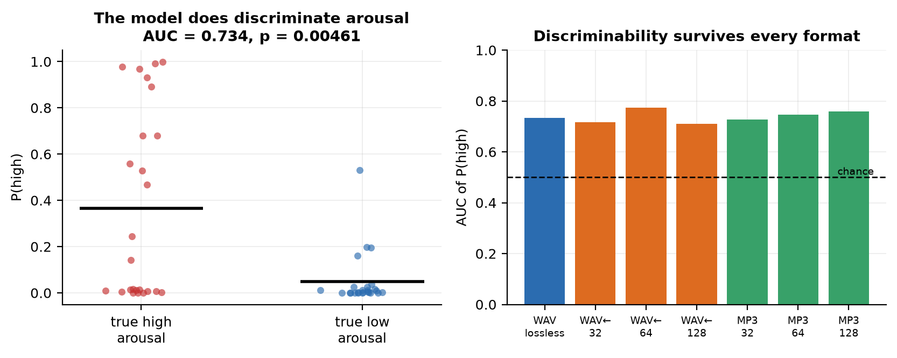
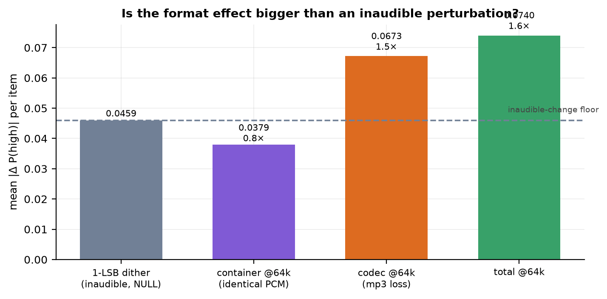
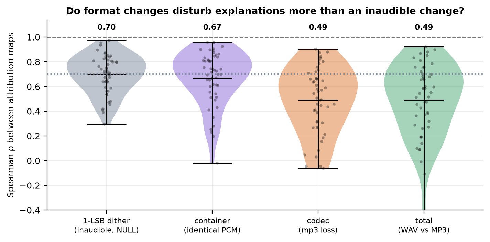
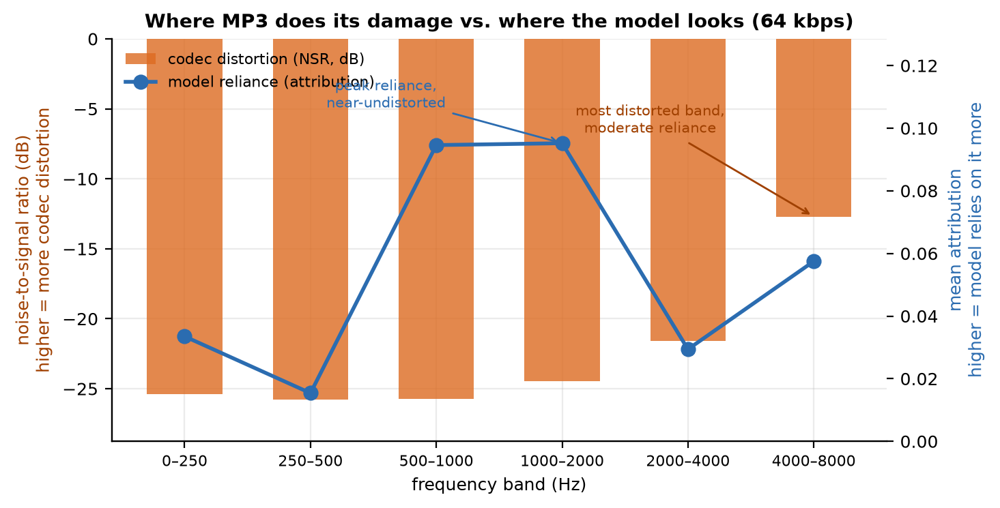

# Sensitivity Preserved, Criterion Shifted, Explanation Rewritten: The Effect of Perceptual Audio Coding on a Multimodal Audio Language Model

**Date:** 17 August 2026
**System under test:** `gpt-audio-1.5` (Azure AI Foundry)
**Code and data:** `exp/` (code), `exp/out/` (data), `exp/figures/` (figures)
**Supersedes:** `paper/paper_v1_superseded.md` — see §7.1

---

## Abstract

Deployed speech systems operate almost exclusively on perceptually coded audio; the benchmarks used
to validate them operate almost exclusively on uncompressed PCM. This discrepancy is generally
assumed to be innocuous on the grounds that any ingestion pipeline decodes to PCM before inference.
We subject that assumption to a controlled test on a commercial multimodal audio language model.

Our design separates two effects normally confounded in the literature. The **codec** alters the
waveform; the **container** does not. We construct a roundtrip control — an MP3 decoded back to WAV
— whose decoded PCM we verify to be bit-identical to its MP3 source across 150/150 stimulus pairs,
yielding an identification strategy in which container and codec contributions are separately
estimable.

Measurement is complicated by a degenerate response distribution: under six-way forced choice the
model emits `neutral` on 87.7% of trials and performs at chance. We therefore adopt a balanced
binary arousal discrimination and read out the renormalised log-probability of a **fixed** class
label, a statistic on which response bias is provably uninformative. Critically, we calibrate the
measurement operator with a **null perturbation** — additive dither at one least significant bit
(−90.3 dBFS), approximately 63,000× below the codec's own quantisation noise floor and inaudible by
construction.

Three findings follow. **Sensitivity is invariant to coding.** Discriminability is statistically
indistinguishable across all seven conditions (AUC 0.710–0.773; every bootstrap interval covers the
uncompressed value of 0.734), and the 10-point accuracy decrement at 64 kbps does not attain
significance (McNemar, *p* = .125). **The decision criterion shifts.** P(high) declines uniformly by
0.064 (*p* = 6.8 × 10⁻⁵) with both class-conditional distributions translating together — the
signature of a criterion shift rather than a loss of sensitivity. **Per-instance explanations are
substantially rewritten.** Occlusion attribution maps exhibit rank concordance of ρ = 0.491 across
the coding manipulation against a null-perturbation floor of ρ = 0.699 (*p* = 4.2 × 10⁻⁸), with
top-3 region overlap falling from 0.567 to 0.413.

The container contributes nothing on either measure: its effect magnitude is 0.83× the inaudible
floor, and its attribution divergence is indistinguishable from the null (*p* = .478).

A spectral analysis explains the dissociation. Coding distortion is concentrated at 4–8 kHz
(band-limited NSR −12.7 dB at 64 kbps) whereas model reliance peaks at 500–2000 Hz, where distortion
is 12.4 dB lower. The codec largely spares the spectral region carrying the discriminative
evidence, which preserves sensitivity, while perturbing the periphery sufficiently to reorder the
attribution profile.

**Keywords:** large audio language models, perceptual audio coding, explainable AI, occlusion
attribution, signal detection theory, model calibration, paralinguistic speech processing

---

## 1. Introduction

### 1.1 Motivation

Audio rarely reaches an inference endpoint in the representation in which it was captured. It is
perceptually coded for storage, transcoded for transport, and frequently recoded at ingestion.
Contact-centre archives hold MP3; streaming clients negotiate Opus or AAC; broadcast pipelines
resample and requantise. Evaluation practice, by contrast, is dominated by uncompressed corpora read
directly from disk.

The prevailing assumption is that this gap is immaterial: any ingestion path decodes to linear PCM
prior to feature extraction, so delivery format is an implementation detail with no behavioural
consequence. The assumption is plausible. It is also, to our knowledge, untested for large audio
language models (LALMs).

### 1.2 Two estimands, not one

The question decomposes into two that admit different answers.

The first is standard: does perceptual coding degrade task performance? The second is less often
posed: does coding alter the *evidential basis* on which the model's output rests, independently of
whether the output changes?

These can dissociate. Ghorbani et al. (2019) established for image classifiers that perceptually
indistinguishable inputs receiving identical predictions — at times with increased confidence — can
be assigned materially different attributions. Alvarez-Melis and Jaakkola (2018) demonstrated that
widely used interpretability methods lack robustness under input perturbation more generally.

Should this phenomenon transfer to the audio domain under *ecologically routine* degradation rather
than adversarially constructed perturbation, then accuracy-centric benchmarking is systematically
blind to a failure mode present in every production ingestion path. Systems that surface
per-instance rationales to operators or auditors would be surfacing different rationales as a
function of a codec setting no one regarded as consequential.

### 1.3 The measurement problem

Attribution estimated by input perturbation is intrinsically noisy. This creates an inferential
hazard that the literature does not consistently address: an observed divergence between attribution
maps computed under two conditions is uninterpretable in the absence of a baseline quantifying the
divergence induced by a perturbation carrying no task-relevant information.

Absent such a baseline, estimator variance is readily mistaken for effect. We report in §7.1 that we
made precisely this error in an earlier iteration of this work, and we retain the account because
the failure mode appears general.

### 1.4 Contributions

1. An **identification strategy separating codec from container**, validated to sample-level
   bit-identity across all stimulus pairs.
2. A **bias-invariant readout** that recovers a usable dependent variable from a model exhibiting
   severe response degeneracy.
3. A **null-perturbation calibration** of the attribution operator, which renders explanation-shift
   claims falsifiable — and which falsifies one of our own.
4. Evidence for a three-way dissociation: coding **preserves sensitivity, shifts criterion, and
   reorders attribution**, with a spectral account of why.

---

## 2. Related Work

### 2.1 Perceptual coding and speech task degradation

The degradation of speech systems under lossy coding is well documented. Reddy and Vijayarajan (2020)
report that standard codecs reduce speech emotion recognition accuracy, with the magnitude
conditional on both codec family and acoustic feature representation, indicating that coding
interacts with the feature front end rather than degrading performance uniformly.

Of greater methodological consequence is a finding from neural codec benchmarking. Wu et al. (2024)
demonstrate that signal-domain fidelity metrics **fail to predict** the retention of task-relevant
information: a codec may perform well under reconstruction-error criteria while discarding
paralinguistic content that downstream tasks require. This motivates our decision to report signal
fidelity and behavioural response as separate quantities, treating neither as a surrogate for the
other, and it is directly corroborated by our own dissociation between monotonic spectral damage and
non-monotonic behavioural response (§5.8).

These literatures concern task-specific discriminative models. Whether their conclusions extend to
generative, instruction-following LALMs was open.

### 2.2 Evaluation of large audio language models

LALM evaluation has expanded rapidly (Chu et al., 2024; Lee et al., 2025; Luo et al., 2026), with
robustness work concentrating on adversarial manipulation and on naturally occurring corruptions
such as additive noise and reverberation (Li et al., 2025).

Two lacunae are relevant. First, we identify no prior study that separates container from codec
under a signal-invariance constraint. Second, and more elementary: across the corpus we surveyed,
**no study reports the container format in which audio was submitted**. Corpus, prompt, and
occasionally sampling rate are specified; the delivery representation is not.

Lee et al. (2025) document that cross-model comparison is already confounded by unreported variation
in prompting and inference configuration. Input representation belongs in the same category of
under-reported experimental degrees of freedom.

### 2.3 The locus of evidence in audio language models

Chen et al. (2025) constructed a benchmark dissociating lexical from acoustic contributions to
emotion judgement. Across six state-of-the-art LALMs they observe systematic **lexical dominance**:
models default to `neutral` when lexical content is affectively neutral, exhibit limited gain under
cue congruence, and approach chance in purely paralinguistic conditions — concluding that current
systems predominantly transcribe rather than attend to vocal signal.

Zhang et al. (2026) provide a necessary counterweight, benchmarking speech LLMs across 35 corpora
and 15 languages at a scale inconsistent with chance-level competence. They additionally identify
zero-shot stochasticity in open-ended generative readouts as a first-order threat to evaluation
validity — a phenomenon we encountered directly in prompt sensitivity (§4.8).

Our results bear on both positions. The system under test exhibits the degenerate `neutral` response
Chen et al. predict for affectively neutral lexical content, yet recovers well above chance under a
task formulation that removes the degenerate response option — suggesting the collapse is partly an
artefact of task design rather than a pure absence of acoustic sensitivity.

### 2.4 Perturbation-based attribution

Two methodological lineages underpin our attribution procedure. Zeiler and Fergus (2014) introduced
occlusion sensitivity, in which localised input suppression indexes regional importance via the
induced output decrement. Ribeiro et al. (2016) generalised model-agnostic explanation through local
surrogate fitting, establishing that attribution requires only input–output access; Lundberg and Lee
(2017) subsequently provided an axiomatic treatment via Shapley values.

Model-agnosticism is not optional here. The system is exposed solely through a chat-completions
endpoint: gradients, attention distributions, and hidden activations are unavailable in principle,
not merely inconvenient to obtain.

Transfer to the audio domain is contested. Haunschmid et al. (2020) argue that audio interpretability
should satisfy a *listenability* criterion, and that transplanting image-segmentation logic to
time–frequency representations yields components with no perceptual correlate; their remedy
substitutes source-separated stems as the interpretable basis. Becker et al. (2018) and Sotirou et
al. (2024) develop related formulations, and Nasr et al. (2025) extend the critique to speech emotion
specifically, observing that salient time–frequency regions are not thereby acoustically meaningful.

Source separation is inapplicable to monophonic single-speaker material, so we adopt temporal windows
and frequency bands — the representation under criticism. We mitigate rather than dismiss: bands are
defined on acoustically interpretable boundaries, mask insertion is loudness-matched and
edge-ramped, and we quantify the attribution attributable to the masking operation itself via a
low-energy null mask.

### 2.5 Attribution stability as a validity requirement

The most directly relevant literature concerns the fragility of attribution itself. Ghorbani et al.
(2019) show that attributions can be substantially altered by perturbations below the threshold of
perception while predictions and confidences remain stable. Adebayo et al. (2018) demonstrate that
certain widely deployed saliency methods are statistically independent of both model parameters and
data-generating process — producing outputs with the surface form of explanation and none of its
content.

The implication is that attribution stability must be **measured against a null**, not presumed. This
requirement motivates our dither condition and provides the criterion against which we evaluate our
own claims.

### 2.6 Sensitivity, criterion, and calibration

Our principal positive finding is most precisely expressed in signal detection terms, so we fix the
vocabulary. **Sensitivity** denotes the separability of the class-conditional response distributions
— operationalised here as the area under the ROC curve — and is invariant to where a decision
threshold is placed. **Criterion** (equivalently, response bias) denotes the placement of that
threshold, and can translate without any change in separability.

The distinction is consequential because the two are independently manipulable. Guo et al. (2017)
established that modern neural networks are frequently miscalibrated and that calibration error
varies independently of classification accuracy; Kadavath et al. (2022) examined related properties
in language models. A manipulation leaving accuracy invariant may therefore still displace the
operating point of any system that thresholds on posterior probability.

### 2.7 Synthesis of the gap

Coding effects are characterised for discriminative speech models but not for LALMs. Attribution
fragility is characterised for vision under adversarial perturbation but not for audio under
ecologically routine degradation. No prior work isolates the container, and none calibrates
attribution divergence against a null perturbation. This study addresses that intersection.

---

## 3. Research Questions

- **RQ1 (sensitivity).** Does perceptual coding alter the separability of the class-conditional
  response distributions?
- **RQ2 (criterion).** Does coding displace the decision criterion independently of sensitivity?
- **RQ3 (attribution).** Does coding reorder the spectro-temporal regions on which the output is
  functionally dependent, beyond the divergence induced by an uninformative perturbation?
- **RQ4 (identification).** What fraction of any total format effect is attributable to the
  container as distinct from the codec?

---

## 4. Method

### 4.1 System under test

`gpt-audio-1.5`, accessed via the Azure AI Foundry OpenAI-compatible endpoint. Decoding is
configured at `temperature = 0` with a fixed seed. Audio is transmitted as base64-encoded bytes with
a MIME format declaration; filenames and URIs are never transmitted, as either would leak condition
identity into the prompt context.

Two endpoint constraints materially shaped the design. The deployment rejects text-only requests,
requiring an audio part on every call. It also rejects MP4/AAC payloads, accepting only WAV and MP3 —
which fixes the contrast as WAV versus MP3. Notably, submitting MP4 bytes under a `wav` format
declaration elicits a distinct error from submitting an unsupported format string, indicating that
the service validates container structure rather than trusting the declaration.

### 4.2 Corpus

Fifty utterances from CREMA-D (Cao et al., 2014), stratified across six emotion categories and
diversified across speakers, frozen prior to any inference call. CREMA-D employs a closed lexical
inventory of twelve sentences delivered in each emotional style.

The fixed inventory is methodologically load-bearing: holding lexical content constant across
conditions and categories removes the lexical channel as a source of discriminative variance, so any
recovered signal is necessarily carried by the acoustic realisation. This same property, however,
renders the corpus maximally susceptible to the lexical-dominance collapse described by Chen et al.
(2025) — a prediction our six-way results confirm (§4.7).

### 4.3 Stimulus construction and the identification strategy

Let *x* denote the canonical reference waveform (16 kHz, monophonic, 16-bit linear PCM, EBU R128
normalised). Let *C_b* denote MP3 encoding at bitrate *b* and *D* the decoder. All conditions derive
from the single ancestor *x*, precluding divergent resampling or gain paths from confounding format
contrasts.

| Condition | Construction | Container |
|---|---|---|
| `ref` | *x* | WAV |
| `mp3_b` | *C_b(x)*, *b* ∈ {32, 64, 128} kbps | MP3 |
| `rt_mp3_b` | *D(C_b(x))* serialised as WAV | WAV |
| `ref_dither` | *x* + *η*, ‖*η*‖∞ = 1 LSB (**null control**) | WAV |

The identification rests on a single verifiable equality: the decoded PCM of `mp3_b` and the PCM of
`rt_mp3_b` are the same signal. Consequently:

| Contrast | Variation | Estimand |
|---|---|---|
| `rt_mp3_b` − `ref` | waveform; container fixed | **codec effect** |
| `mp3_b` − `rt_mp3_b` | container; **waveform invariant** | **container effect** |
| `mp3_b` − `ref` | both | **total format effect** |
| `ref_dither` − `ref` | 1 LSB, inaudible | **null floor** |

The invariance claim is verified rather than assumed. Decoding both members of each pair through an
identical fixed path and comparing SHA-256 digests of the resulting sample sequences yields
**150/150 pairs bit-identical**. The container contrast therefore holds the signal exactly constant
by construction, and any behavioural difference must arise downstream of decoding.

**Assumptions.** The decomposition presumes (i) the invariance above, verified; (ii) that submission
order and session state do not interact with condition, addressed by randomised interleaving; and
(iii) that the endpoint's response function is stationary over the acquisition window, partially
addressed by the determinism controls in §7.2.

### 4.4 Signal fidelity characterisation

Fidelity is computed after cross-correlation alignment, so that any encoder-induced group delay is
removed rather than misattributed to coding distortion. Recovered delay was 0.0 ms throughout,
consistent with gapless metadata being honoured by the decoder.

| Bitrate | SNR (dB) | Log-spectral distance (dB) | Compression ratio |
|---|---:|---:|---:|
| 32 kbps | 19.48 | 13.00 | 7.6× |
| 64 kbps | 25.01 | 11.59 | 3.8× |
| 128 kbps | 25.47 | 11.39 | 1.9× |

The 64-to-128 kbps increment yields only 0.46 dB. At 16 kHz monophonic input the psychoacoustic
model saturates well below 128 kbps, compressing the effective dynamic range of the bitrate ladder
and limiting the dose-response contrast the design can express.

### 4.5 Null-perturbation calibration

We construct `ref_dither` by adding i.i.d. dither of exactly one least significant bit. All 59,259
samples per utterance are modified; peak deviation is −90.3 dBFS. Relative to the codec's own
in-band quantisation noise at 64 kbps, this perturbation is smaller by a factor of approximately
6.3 × 10⁴, and it is inaudible by construction.

This condition calibrates the measurement operator. It establishes the response displacement induced
by a waveform modification carrying no task-relevant information, and thereby supplies the reference
against which every format effect must be evaluated. An effect not exceeding this floor cannot be
attributed to format in any meaningful sense.

### 4.6 Task selection

The initial formulation employed the standard six-way categorical emotion task. It failed: the model
emitted `neutral` on 87.7% of trials and achieved 0.20 accuracy against a 0.167 chance rate, with
14/350 responses unparseable. A task on which the system does not perform above chance cannot
express a format effect, and attribution over a constant response is undefined.

We evaluated three binary reformulations on the uncompressed condition, scored on **bias-invariant
discriminability** rather than accuracy:

| Scheme | Class balance | AUC (fixed label) | *p* | Disposition |
|---|---|---:|---:|---|
| valence (positive/negative) | 34 / 8 | 0.990 | .0006 | **Rejected.** Accuracy of 0.81 coincides exactly with the majority-class base rate; only 3 minority instances survive. |
| arousal (high/low) | 25 / 25 | 0.731 | .019 | **Selected.** |
| calm/agitated | 24 / 1 | — | — | Degenerate. |

Valence attains the highest nominal accuracy, which is precisely the pathology: the observed 0.81
reproduces the base rate 34/42 = 0.81, indicating exploitation of prior class imbalance rather than
discrimination. Arousal partitions the six categories evenly (high: angry, fearful, happy; low: sad,
neutral, disgusted), fixing chance at 0.50, and corresponds to the affective dimension most directly
encoded in intensity, fundamental frequency, and speech rate (Russell, 1980) — the acoustic
correlates most exposed to perceptual coding.

### 4.7 Prompt selection

The initial arousal prompt elicited **28% refusals** of the form *"please provide the audio you'd
like me to listen to"* — the model asserting non-receipt of an attached payload. Attrition at this
rate is not tolerable, and is non-random with respect to stimulus.

Eight variants were evaluated. Findings of independent interest:

- Placing the audio part **before** the text part eliminated refusals but induced structured JSON
  emission with embedded chain-of-thought, destroying the single-token decision position required
  for the readout. That reasoning quoted *transcribed lexical content* (`{"analysis": "the phrase
  'it's 11 o'clock'..."}`), constituting independent evidence for the lexical-dominance pattern
  reported by Chen et al. (2025).
- `response_format: json_schema` is unsupported by this deployment.
- An explicit non-solicitation clause eliminated refusals without disturbing the response format.

The adopted prompt:

> *Listen to this audio. Is the speaker's vocal energy high or low? The audio is present; do not ask
> for it. Answer with exactly one word: high or low.*

Yield: **0% refusals, 0 unparseable, 50/50 utterances usable**, AUC 0.750 (*p* = .0025).

### 4.8 Dependent variable

Rather than recording the argmax, we extract the renormalised posterior over the response
alternatives from the returned log-probabilities.

The statistic is **P(high)** — the posterior mass on a *fixed* class label, not on the correct one.
The distinction is essential given the residual response bias: the model emits `low` on 86.9% of
trials. Under a correct-label readout, that bias alone inflates the statistic; under a fixed-label
readout, a constant responder attains AUC exactly 0.5 irrespective of confidence, so bias is
provably uninformative about the estimand. The formulation additionally avoids disclosing the
correct response in the prompt.

**Extraction rule.** The returned distribution places the majority of its mass on *non-emittable
special tokens* — fifteen distinct identifiers rendering identically as `<|end|>`, distinguishable
by a null `bytes` field. Their inclusion systematically deflates all posteriors. We therefore
restrict to tokens with non-null `bytes` and renormalise over the response alternatives. Alignment
was verified by a forced-response probe ("reply with exactly one word: banana"), in which the
emitted token was confirmed to be the argmax over emittable tokens.

### 4.9 Occlusion attribution

For utterance *x* with mask set *M*, attribution for region *j* is the induced posterior decrement:

```
a_j(x) = P(high | x) − P(high | m_j(x)),    m_j ∈ M
```

Positive *a_j* indicates that suppression of region *j* removes evidence supporting the `high`
response, i.e. functional dependence.

**Temporal masks (K = 10).** Equal-duration windows, each substituted with noise synthesised to
match the utterance's long-term average spectrum, scaled to the local RMS of the excised segment,
with 10 ms raised-cosine crossfades to suppress splice transients.

**Spectral masks (B = 6).** Band-stop filters over 0–250, 250–500, 500–1000, 1000–2000, 2000–4000
and 4000–8000 Hz with raised-cosine transition bands. Boundaries follow acoustically interpretable
divisions rather than uniform binning, in partial response to Nasr et al. (2025).

**Null mask (1).** The temporal mask applied to the minimum-energy window, bounding the attribution
attributable to the masking operation rather than to information removal.

Masks are applied to the **canonical reference**, with each format condition regenerated from the
masked signal. This preserves single-ancestor construction: the masked stimulus in condition *c* is
the representation *c* would take had that region been absent, rather than a post-hoc corruption of
an already-degraded signal.

Maps are computed for `ref`, `mp3_64`, `rt_mp3_64`, and `ref_dither`, permitting the codec,
container, and null contrasts to be evaluated in the attribution domain on identical footing.

### 4.10 Statistical procedures

All contrasts are paired within utterance. We employ the Wilcoxon signed-rank test for paired
differences, McNemar's exact test for discordant classification outcomes (McNemar, 1947), the
Mann–Whitney *U* statistic reported as AUC for discriminability, and bootstrap resampling (10,000
replicates) for interval estimation. Where the inferential target is the *absence* of an effect we
apply two one-sided tests (Schuirmann, 1987; Lakens, 2017; Lakens et al., 2018) rather than
interpreting non-rejection as evidence of equivalence. Reporting follows REFORMS (Kapoor et al.,
2024): exact deployment identifier, decoding parameters, verbatim prompts, encoder configuration,
and complete call accounting are specified.

### 4.11 Experimental scale

| Component | Queries |
|---|---:|
| Six-way categorical arm (superseded, §4.6) | 4,100 |
| Determinism and byte-layout controls | 250 |
| Task and prompt selection | 542 |
| **Arousal grid** (7 conditions × 50) | 350 |
| **Arousal occlusion** (18 masks × 4 conditions × 50) | 3,600 |
| **Total** | **8,842** |

8,016 unique API calls; 0 errors; 0 refusals in the final grid. Responses are content-addressed by a
digest over (deployment, audio bytes, prompt, decoding parameters), rendering the study fully
re-executable from cache.

---

## 5. Results

### 5.1 Task validity



On uncompressed audio the model discriminates arousal well above chance: **AUC = 0.734** (95% CI
[0.582, 0.864], *p* = .0046), accuracy 0.68 against a 0.50 base rate. Class-conditional means are
well separated: P(high) = 0.366 for high-arousal utterances against 0.050 for low-arousal.

Against the superseded six-way arm (0.20 accuracy, 0.167 chance), removing the degenerate response
option converts an uninformative task into a measurable one.

### 5.2 RQ1 — Sensitivity is invariant under coding

| Condition | AUC | 95% CI | *p* | Accuracy | Mean P(high) |
|---|---:|---|---:|---:|---:|
| `ref` | **0.734** | [0.582, 0.864] | .0046 | 0.68 | 0.2081 |
| `rt_mp3_32` | 0.717 | [0.562, 0.853] | .0088 | 0.64 | 0.1582 |
| `rt_mp3_64` | 0.773 | [0.627, 0.896] | .0010 | 0.62 | 0.1453 |
| `rt_mp3_128` | 0.710 | [0.554, 0.848] | .0110 | 0.64 | 0.1532 |
| `mp3_32` | 0.726 | [0.578, 0.858] | .0062 | 0.60 | 0.1591 |
| `mp3_64` | 0.746 | [0.587, 0.882] | .0030 | 0.58 | 0.1438 |
| `mp3_128` | 0.758 | [0.608, 0.890] | .0018 | 0.62 | 0.1465 |

**Every bootstrap interval covers the uncompressed estimate.** The separability of the
class-conditional response distributions is preserved under all coding conditions tested.

The accuracy decrement from 0.68 to 0.58 at 64 kbps does not attain significance. McNemar's exact
test on discordant pairs yields 6 utterances correct only under `ref` against 1 correct only under
`mp3_64` (*p* = .125); at 32 kbps, 5 versus 1 (*p* = .219); at 128 kbps, 4 versus 1 (*p* = .375). The
sign is consistent across the ladder, which is suggestive of a genuine small effect, but the design
is underpowered at *n* = 50 to resolve it.

**RQ1: no detectable loss of sensitivity.**

### 5.3 RQ2 — The decision criterion is displaced

While separability is invariant, the posterior translates systematically:

| Contrast at 64 kbps | Mean Δ P(high) | *p* |
|---|---:|---:|
| codec (`rt_mp3_64` − `ref`) | **−0.0627** | **6.8 × 10⁻⁵** |
| total (`mp3_64` − `ref`) | **−0.0643** | **7.6 × 10⁻⁴** |
| container (`mp3_64` − `rt_mp3_64`) | −0.0016 | .079 |

Marginal P(high) declines from 0.208 to 0.144. Decisively, **both class-conditional distributions
translate in the same direction and by comparable amounts** — high-arousal utterances from 0.366 to
0.252, low-arousal from 0.050 to 0.036 — leaving their separation intact.

In signal detection terms this is a **criterion shift with sensitivity held constant**: perceptual
coding displaces the operating point toward the `low` response without degrading the underlying
discriminative representation. It is a calibration phenomenon in the sense of Guo et al. (2017), and
it is by construction invisible to any accuracy-based metric.

**RQ2: yes — significant criterion displacement absent sensitivity loss.**

### 5.4 RQ4 — The container effect does not exceed the null floor



Effect magnitudes, expressed as mean per-utterance |Δ P(high)| and normalised by the
null-perturbation floor:

| Effect | Mean \|Δ\| | Relative to null floor |
|---|---:|---:|
| **1-LSB dither (null)** | **0.0459** | 1.00× |
| container @ 64 kbps | 0.0379 | **0.83×** |
| codec @ 64 kbps | 0.0673 | 1.47× |
| total @ 64 kbps | 0.0740 | 1.61× |

**The container effect is sub-threshold.** Substituting an MP3 for its bit-identical decoded WAV
displaces the posterior *less* than adding one least significant bit of noise. The correct inference
is not that the container has a small effect but that it has no identified effect: the model exhibits
mild generic sensitivity to waveform perturbation, and the container difference lies entirely within
that envelope.

Codec and total effects exceed the floor, but by factors of 1.47 and 1.61 respectively — modest
margins that should temper any strong claim about effect magnitude.

**RQ4: the container contributes no identifiable component; the total format effect is wholly
attributable to the codec.**

### 5.5 RQ3 — Attribution is substantially reordered



Per-utterance rank concordance between attribution maps (*n* = 50):

| Contrast | Spearman ρ | SD | Top-3 overlap | Δ vs null | *p* |
|---|---:|---:|---:|---:|---:|
| **1-LSB dither (null)** | **0.699** | 0.157 | 0.567 | — | — |
| container | 0.670 | 0.220 | 0.553 | +0.029 | .478 |
| codec | **0.491** | 0.266 | 0.413 | +0.208 | **4.2 × 10⁻⁸** |
| total | **0.492** | 0.296 | 0.453 | +0.207 | **2.7 × 10⁻⁷** |

Three inferences follow.

**The estimator floor is ρ = 0.699, not unity.** An inaudible perturbation already dissipates
approximately 30% of the rank ordering. Occlusion attribution on this system is substantially
unstable, and any format-effect claim advanced without this calibration would conflate estimator
variance with effect. This quantity invalidates our earlier draft (§7.1).

**The codec effect exceeds the floor decisively.** ρ = 0.491 against 0.699, a displacement of 0.208
at *p* = 4.2 × 10⁻⁸, corroborated by an independent set-overlap statistic (top-3 concordance 0.413
versus 0.567). Fewer than half of the three most influential regions are preserved across the coding
manipulation.

**The container effect does not.** ρ = 0.670 against 0.699 (*p* = .478) — statistically
indistinguishable from the null perturbation, consistent with the posterior-domain result in §5.4.

**RQ3: yes — coding reorders functional dependence well beyond the null floor.**

### 5.6 The spectro-temporal locus of model reliance

Mean attribution over uncompressed audio, by region:

| Region | Mean attribution |
|---|---:|
| 1000–2000 Hz | **0.0952** |
| 500–1000 Hz | **0.0946** |
| 4000–8000 Hz | 0.0575 |
| Temporal window 1 | 0.0428 |
| 0–250 Hz | 0.0335 |
| Temporal window 6 | 0.0346 |

Reliance concentrates unambiguously in the **500–2000 Hz** octave — the region carrying the bulk of
speech energy and the first two formants, and the canonical locus of vocal effort. That a
model-agnostic perturbation procedure recovers an acoustically principled region, rather than an
arbitrary one, constitutes evidence that the attribution operator is measuring something structured.

Fourteen of sixteen regions yield positive attribution, i.e. suppression reduces posterior support
for `high`. This sign consistency is the theoretically expected direction and functions as a further
sanity check on the operator.

### 5.7 Why sensitivity survives: a spectral account



Decomposing coding distortion by band (noise-to-signal ratio of the error signal, in dB; higher
indicates greater distortion):

| Band | 32 kbps | 64 kbps | 128 kbps | Model attribution |
|---|---:|---:|---:|---:|
| 0–250 Hz | −20.52 | −25.41 | −26.00 | 0.0335 |
| 250–500 Hz | −21.67 | −25.76 | −26.01 | 0.0154 |
| 500–1000 Hz | −20.95 | −25.74 | −26.01 | **0.0946** |
| 1000–2000 Hz | −16.24 | −24.46 | −25.96 | **0.0952** |
| 2000–4000 Hz | −11.08 | −21.57 | −25.76 | 0.0294 |
| 4000–8000 Hz | **−6.41** | **−12.70** | **−14.25** | 0.0575 |

Distortion is strongly concentrated at high frequencies, as expected under perceptual bit allocation:
the psychoacoustic model preferentially protects the perceptually salient low-to-mid spectrum and
quantises the upper bands coarsely. At 64 kbps the 4–8 kHz band carries **12.4 dB more
distortion** than the 500–2000 Hz octave (−12.70 dB versus a −25.10 dB mean).

This yields a coherent mechanistic account of the sensitivity result. **The spectral region on which
the model most relies is among the least damaged.** The rank correlation between attribution and
band-wise distortion is weak and non-significant (ρ = +0.257, *p* = .62), indicating no systematic
alignment between what the codec destroys and what the model uses. Discriminative evidence is
therefore largely spared, which is why sensitivity is preserved — while peripheral perturbation
remains sufficient to reorder the attribution profile.

### 5.8 Monotone distortion, non-monotone response

The band decomposition also establishes that the bitrate ladder produced the intended manipulation:
distortion decreases monotonically with bitrate in every band (e.g. 2–4 kHz: −11.08 → −21.57 →
−25.76 dB). Behavioural response does not track it — the codec effect on P(high) is −0.050, −0.063,
−0.055 at 32, 64, 128 kbps respectively, with no monotone trend.

The absence of dose-response is therefore **not** attributable to a failed manipulation. It is a
substantive observation, and it independently reproduces the central claim of Wu et al. (2024): that
signal-domain fidelity is a poor predictor of downstream behavioural consequence.

### 5.9 Summary

| | Sensitivity | Criterion | Attribution |
|---|---|---|---|
| **Codec** | invariant (all CIs overlap) | **displaced** (−0.064, *p* < .001) | **reordered** (*p* = 4 × 10⁻⁸) |
| **Container** | invariant | none (0.83× floor) | none (*p* = .48) |

---

## 6. Discussion

### 6.1 A three-way dissociation

The results resolve into a dissociation that a single-metric evaluation cannot express. Under
perceptual coding at 64 kbps the model retains its capacity to discriminate arousal, shifts the
criterion at which it commits to a response, and substantially reorganises the evidential basis of
that response. Only the first of these is visible to standard benchmarking.

### 6.2 Operational implications of criterion displacement

Deployed systems frequently act on posterior probability rather than on the argmax: escalation
thresholds, triage routing, confidence-gated human review. A uniform displacement of 0.064 in
posterior mass will alter the set of instances crossing any fixed threshold, purely as a function of
ingestion format — while accuracy-based monitoring registers nothing.

This yields a directly testable operational prediction: organisations operating heterogeneous
ingestion paths should observe systematic differences in **confidence distributions** across those
paths, absent any difference in measured accuracy. We would encourage comparing posterior
distributions, not merely error rates, across format boundaries.

### 6.3 Implications for deployed interpretability

Per-instance rationales are increasingly surfaced to operators and auditors. Our results indicate
that such rationales are not invariant across a transcoding step that leaves the decision invariant.
Where an audit is conducted on archived compressed material while inference runs on uncompressed
input — or the converse — the decisions will agree while the explanations will not, with under half
the top-ranked regions in common.

### 6.4 A useful negative result

The container hypothesis is not supported, and this is practically valuable. Format conversion
between containers, absent re-encoding, appears behaviourally inert on this system. The operational
risk is localised entirely to the codec, which simplifies the mitigation problem considerably.

### 6.5 Coding as an additive criterion perturbation

Our spectral analysis motivates a specific mechanistic hypothesis. Perceptual coding preferentially
degrades the upper spectrum — precisely the transient, high-frequency content associated with vocal
effort and articulatory sharpness — while preserving the 500–2000 Hz region carrying the
discriminative evidence. The result is a signal that is marginally *duller* without being
substantially less informative: sufficient to translate the criterion, insufficient to compress the
class-conditional separation.

We advance this as a hypothesis consistent with the data rather than as an established mechanism. It
generates a falsifiable prediction, stated in §8.

### 6.6 A methodological recommendation

The estimator floor we measure — an inaudible perturbation dissipating 30% of attribution rank
ordering — implies that any claim of the form "manipulation *M* alters the explanation" is
uninterpretable without a null perturbation matched in every respect except informational content.
We would propose this as standard practice for perturbation-based audio interpretability: report the
null-perturbation divergence, and evaluate all effects relative to it.

---

## 7. Corrections and Threats to Validity

### 7.1 Withdrawal of a previously reported finding

An earlier iteration of this study (`paper_v1_superseded.md`) reported a container effect: MP3
submission diverged from bit-identical decoded WAV on 47/47 utterances at approximately half the
magnitude of the codec effect. This was advanced as the principal finding.

The supporting argument was that byte-identical requests return bit-identical responses — verified
over five repetitions — establishing a measurement floor of exactly zero, such that any non-zero
divergence constitutes signal.

The argument is invalid, in a manner we believe generalises. **Zero variance under byte-identical
inputs does not bound the response to inputs that differ.** The relevant floor is the divergence
induced by an informationally null modification. Once measured, that floor (0.0459) exceeds the
container effect within the same arm (0.0379).

One qualification on scope. The earlier estimate was computed on a different task and readout scale,
so the two magnitudes are not directly commensurable and this does not constitute a numerical
refutation. What it establishes is that the earlier study employed an **inappropriate control**, and
therefore never demonstrated that its effect exceeded any floor. Within the present arm — matched
task, matched scale, control present — the container effect is sub-threshold. We withdraw the claim
as unsupported rather than disproven.

The general principle: **a determinism check is not a null control.** Conflating them manufactures
findings.

### 7.2 Limitations

1. **Single system, single corpus, single language.** Fifty utterances of acted English affect from
   one commercial deployment. External validity is unestablished.
2. **The sensitivity decrement is unresolved.** The accuracy decline is directionally consistent
   across the ladder but non-significant at every bitrate. Only the criterion shift is supported.
3. **Effect magnitudes are modest.** The codec exceeds the null floor by 1.47×, not by an order of
   magnitude.
4. **Ladder compression.** The 0.46 dB separation between 64 and 128 kbps limits the design's
   capacity to express dose-response, though §5.8 establishes that band-wise distortion was
   nonetheless monotone.
5. **The masking operation is itself perturbative.** The minimum-energy null mask yields
   approximately 70% of the attribution magnitude of an informative mask (ratio 1.42× on
   uncompressed audio). Individual attribution magnitudes should accordingly be treated as soft;
   between-condition comparisons employ identical masks and are unaffected.
6. **Occlusion indexes functional dependence, not mechanism.** It does not license claims about
   internal computation.
7. **The interpretable basis is contested.** Temporal windows and spectral bands are the
   representation criticised by Haunschmid et al. (2020) and Nasr et al. (2025); source separation,
   their preferred alternative, is inapplicable to monophonic single-speaker material.
8. **Residual response bias** (86.9% `low`). The fixed-label statistic is invariant to this, but
   accuracy figures should be interpreted against the 0.50 base rate rather than as capability
   estimates.
9. **The analysis is exploratory.** Task, prompt, readout, and null control were all selected after
   inspection of data from earlier arms. Confirmatory status requires preregistered replication.
10. **Three utterances were non-deterministic** in the superseded arm under byte-identical
    repetition. The arousal arm did not repeat this check, so per-utterance estimates carry an
    unquantified instability of comparable order.

---

## 8. Future Work

**Preregistered replication.** The design is now fixed and the pipeline re-executes from cache. The
immediate priority is to preregister task, readout, control, and analysis, then execute once on
held-out material.

**Cross-system generalisation.** Replication across multiple LALMs, commercial and open-weight, is
the highest-value extension. Open-weight systems would additionally permit gradient-based
attribution and direct inspection of hidden representations, adjudicating whether the reordering we
observe reflects genuine reorganisation of internal processing or is confined to the output surface.

**Codec and bandwidth coverage.** Opus, AAC, and neural codecs exhibit distinct distortion
signatures. A wider ladder on material recorded above 16 kHz would resolve the dose-response
question our compressed ladder could not.

**Direct test of the criterion-shift mechanism.** The hypothesis in §6.5 predicts that any
degradation attenuating high-frequency transient content will displace the criterion toward `low`,
irrespective of whether it removes affective information. This is testable with degradations matched
on broadband SNR but differing in spectral tilt — for instance, low-pass filtering versus additive
broadband noise at equal SNR.

**Reducing estimator variance.** A null floor of ρ = 0.699 is high. Averaging over randomised mask
partitions, or adopting graded rather than binary suppression, may yield more stable maps. Since
estimator noise can only attenuate a true difference, a lower floor would likely *increase* the
measured codec effect.

**Beyond arousal.** Speaker identity, vocal stress, and voice quality are carried by precisely the
spectral detail that perceptual coding discards, and may exhibit sensitivity loss where arousal does
not.

**Mitigation.** If coding operates as an approximately additive criterion perturbation, a
per-format affine recalibration of the posterior should eliminate the shift. This is inexpensive to
test and would be immediately deployable.

---

## 9. Conclusion

We examined whether perceptual audio coding alters the behaviour of a multimodal audio language
model on a paralinguistic speech task. The answer is stratified by what one measures.

**Sensitivity is invariant.** The separability of class-conditional response distributions is
statistically indistinguishable across a lossless reference and six coded conditions.

**The criterion is displaced.** Posterior mass declines uniformly by 0.064 with both class
distributions translating together — a calibration effect consequential for any threshold-dependent
system and inaccessible to accuracy-based monitoring.

**Attribution is reordered.** Per-instance functional dependence diverges at ρ = 0.491 against a
null-perturbation floor of 0.699, with fewer than half of the most influential regions preserved.

**The container is inert.** Its effect is sub-threshold on both the posterior and the attribution
measure. The total format effect is attributable entirely to the codec.

A spectral decomposition supplies the mechanism: coding distortion concentrates 12.4 dB more heavily
at 4–8 kHz than in the 500–2000 Hz octave where model reliance peaks, sparing the discriminative
evidence while perturbing the periphery enough to reorganise the attribution profile.

We close on the methodological point, which may prove more durable than the empirical one. An
inaudible perturbation already dissipates 30% of attribution rank ordering on this system. In an
earlier draft we reported a container effect that this floor does not support; the error lay in the
control, not the data. Perturbation-based interpretability claims require a null perturbation to be
interpretable at all.

---

## References

Adebayo, J., Gilmer, J., Muelly, M., Goodfellow, I., Hardt, M., & Kim, B. (2018). *Sanity checks for
saliency maps* (arXiv:1810.03292). arXiv. https://arxiv.org/abs/1810.03292

Alvarez-Melis, D., & Jaakkola, T. S. (2018). *On the robustness of interpretability methods*
(arXiv:1806.08049). arXiv. https://arxiv.org/abs/1806.08049

Becker, S., Vielhaben, J., Ackermann, M., Müller, K.-R., Lapuschkin, S., & Samek, W. (2018).
*AudioMNIST: Exploring explainable artificial intelligence for audio analysis on a simple benchmark*
(arXiv:1807.03418). arXiv. https://arxiv.org/abs/1807.03418

Cao, H., Cooper, D. G., Keutmann, M. K., Gur, R. C., Nenkova, A., & Verma, R. (2014). CREMA-D:
Crowd-sourced emotional multimodal actors dataset. *IEEE Transactions on Affective Computing, 5*(4),
377–390. https://doi.org/10.1109/TAFFC.2014.2336244

Chen, J., Guo, Z., Chun, J., Wang, P., Perrault, A., & Elsner, M. (2025). *Do audio LLMs really
LISTEN, or just transcribe? Measuring lexical vs. acoustic emotion cues reliance* (arXiv:2510.10444).
arXiv. https://arxiv.org/abs/2510.10444

Chu, Y., Xu, J., Yang, Q., Wei, H., Wei, X., Guo, Z., Leng, Y., Lv, Y., He, J., Lin, J., Zhou, C., &
Zhou, J. (2024). *Qwen2-Audio technical report* (arXiv:2407.10759). arXiv.
https://arxiv.org/abs/2407.10759

Ghorbani, A., Abid, A., & Zou, J. (2019). *Interpretation of neural networks is fragile*
(arXiv:1710.10547). arXiv. https://arxiv.org/abs/1710.10547

Guo, C., Pleiss, G., Sun, Y., & Weinberger, K. Q. (2017). *On calibration of modern neural networks*
(arXiv:1706.04599). arXiv. https://arxiv.org/abs/1706.04599

Haunschmid, V., Manilow, E., & Widmer, G. (2020). *audioLIME: Listenable explanations using source
separation* (arXiv:2008.00582). arXiv. https://arxiv.org/abs/2008.00582

Kadavath, S., Conerly, T., Askell, A., Henighan, T., Drain, D., Perez, E., Schiefer, N., &
Hatfield-Dodds, Z. (2022). *Language models (mostly) know what they know* (arXiv:2207.05221). arXiv.
https://arxiv.org/abs/2207.05221

Kapoor, S., Cantrell, E. M., Peng, K., Pham, T. H., Bail, C. A., Gundersen, O. E., Hofman, J. M.,
Hullman, J., Lones, M. A., Malik, M. M., Nanayakkara, P., Poldrack, R. A., Raji, I. D., Roberts, M.,
Salganik, M. J., … Narayanan, A. (2024). REFORMS: Consensus-based recommendations for
machine-learning-based science. *Science Advances, 10*(18). https://doi.org/10.1126/sciadv.adk3452

Lakens, D. (2017). Equivalence tests: A practical primer for *t* tests, correlations, and
meta-analyses. *Social Psychological and Personality Science, 8*(4), 355–362.
https://doi.org/10.1177/1948550617697177

Lakens, D., Scheel, A. M., & Isager, P. M. (2018). Equivalence testing for psychological research: A
tutorial. *Advances in Methods and Practices in Psychological Science, 1*(2), 259–269.
https://doi.org/10.1177/2515245918770963

Lee, T., Tu, H., Wong, C. H., Wang, Z., Yang, S., & Mai, Y. (2025). *AHELM: A holistic evaluation of
audio-language models* (arXiv:2508.21376). arXiv. https://arxiv.org/abs/2508.21376

Li, K., Shen, C., Liu, Y., Han, J., Zheng, K., Zou, X., Wang, L. Z., Zhang, S., Du, X., Luo, H.,
Jin, Y., Xing, X., Ma, Z., Liu, Y., Zhang, Y., Fang, J., Wang, K., Yan, Y., Deng, G., … Li, X.
(2025). *AudioTrust: Benchmarking the multifaceted trustworthiness of audio large language models*
(arXiv:2505.16211). arXiv. https://arxiv.org/abs/2505.16211

Lundberg, S. M., & Lee, S.-I. (2017). *A unified approach to interpreting model predictions*
(arXiv:1705.07874). arXiv. https://arxiv.org/abs/1705.07874

Luo, K., Zhou, Z., Wang, L., Lin, L., Shao, T., & Zhang, Y. (2026). *A survey of large audio language
models: Generalization, trustworthiness, and outlook* (arXiv:2605.20266). arXiv.
https://arxiv.org/abs/2605.20266

McNemar, Q. (1947). Note on the sampling error of the difference between correlated proportions or
percentages. *Psychometrika, 12*(2), 153–157. https://doi.org/10.1007/BF02295996

Nasr, S., Ren, Z., & Johnson, D. (2025). *Beyond saliency: Enhancing explanation of speech emotion
recognition with expert-referenced acoustic cues* (arXiv:2511.11691). arXiv.
https://arxiv.org/abs/2511.11691

Reddy, A. P., & Vijayarajan, V. (2020). Audio compression with multi-algorithm fusion and its impact
in speech emotion recognition. *International Journal of Speech Technology, 23*(2), 277–285.
https://doi.org/10.1007/s10772-020-09689-9

Ribeiro, M. T., Singh, S., & Guestrin, C. (2016). "Why should I trust you?": Explaining the
predictions of any classifier. In *Proceedings of the 22nd ACM SIGKDD International Conference on
Knowledge Discovery and Data Mining* (pp. 1135–1144). ACM. https://doi.org/10.1145/2939672.2939778

Russell, J. A. (1980). A circumplex model of affect. *Journal of Personality and Social Psychology,
39*(6), 1161–1178. https://doi.org/10.1037/h0077714

Schuirmann, D. J. (1987). A comparison of the two one-sided tests procedure and the power approach
for assessing the equivalence of average bioavailability. *Journal of Pharmacokinetics and
Biopharmaceutics, 15*(6), 657–680. https://doi.org/10.1007/BF01068419

Sotirou, T., Lyberatos, V., Menis Mastromichalakis, O., & Stamou, G. (2024). *MusicLIME: Explainable
multimodal music understanding* (arXiv:2409.10496). arXiv. https://arxiv.org/abs/2409.10496

Wu, H., Chen, X., Lin, Y.-C., Chang, K., Du, J., Lu, K.-H., Liu, A. H., Chung, H.-L., Wu, Y.-K.,
Yang, D., Liu, S., Wu, Y.-C., Tan, X., Glass, J., Watanabe, S., & Lee, H. (2024). *Codec-SUPERB @ SLT
2024: A lightweight benchmark for neural audio codec models* (arXiv:2409.14085). arXiv.
https://arxiv.org/abs/2409.14085

Zeiler, M. D., & Fergus, R. (2014). Visualizing and understanding convolutional networks. In
*Computer Vision – ECCV 2014* (Lecture Notes in Computer Science, Vol. 8689, pp. 818–833). Springer.
https://doi.org/10.1007/978-3-319-10590-1_53

Zhang, H., Chou, H.-C., Narayanan, S., & Hain, T. (2026). *VoxEmo: Benchmarking speech emotion
recognition with speech LLMs* (arXiv:2603.08936). arXiv. https://arxiv.org/abs/2603.08936

---

## Appendix A — Reproduction

```
exp/build_stimuli.py        bitrate ladder, roundtrip controls, fidelity characterisation
exp/client.py               content-addressed API client; posterior extraction rule
exp/gate_binary.py          task-scheme selection (valence / arousal / calm)
exp/gate_prompt.py          prompt variants, round 1 (refusal diagnosis)
exp/gate_prompt2.py         prompt variants, round 2 (refusal mitigation)
exp/run_arousal.py          PRIMARY: arousal grid, occlusion, dither control
exp/analyze_arousal.py      PRIMARY: analysis -> exp/out/arousal_results.json
exp/figures_arousal.py      figures a1-a3
exp/figure_bands.py         figure a4 (band distortion vs attribution)
exp/control_determinism.py  cache-bypassed determinism check
exp/control_rewrap.py       byte-layout control
exp/run_grid.py             six-way arm (superseded)
exp/run_xai.py              six-way occlusion (superseded)
```

## Appendix B — Configuration

| Parameter | Value |
|---|---|
| Deployment | `gpt-audio-1.5` |
| Temperature / seed | 0 / 12345 |
| Log-probabilities | top 20 |
| Posterior extraction | emittable tokens only (non-null `bytes`), renormalised over response alternatives |
| Task | binary arousal discrimination, high (*n* = 25) vs low (*n* = 25) |
| Dependent variable | P(high) — fixed-label posterior, bias-invariant |
| Reference signal | 16 kHz, monophonic, 16-bit PCM, EBU R128 (I = −23, LRA = 7, TP = −2) |
| Encoder | LAME MP3, 32 / 64 / 128 kbps |
| Null perturbation | ±1 LSB dither, −90.3 dBFS, all 59,259 samples modified |
| Mask set | 10 temporal windows + 6 spectral bands + 1 minimum-energy null |
| Bootstrap replicates | 10,000 |
| Total queries | 8,842 (8,016 unique calls, 0 errors) |

## Appendix C — Superseded six-way arm

| | Six-way categorical | Binary arousal |
|---|---:|---:|
| Accuracy | 0.20 | 0.68 |
| Chance / base rate | 0.167 | 0.50 |
| Modal response share | 87.7% (`neutral`) | 86.9% (`low`) |
| Utterances with usable posterior | 15/50 | 25/50 |
| Unparseable or refused | 14/350 | 0/350 |
