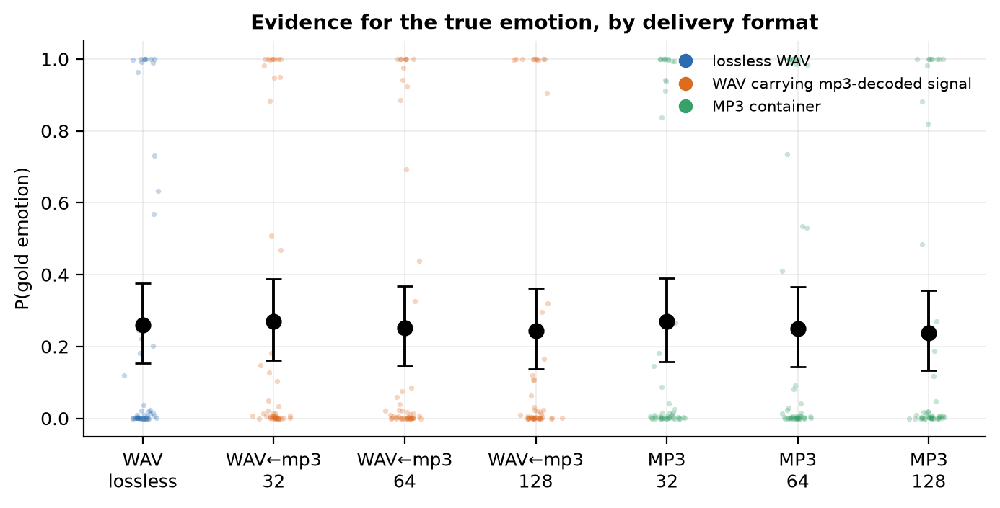
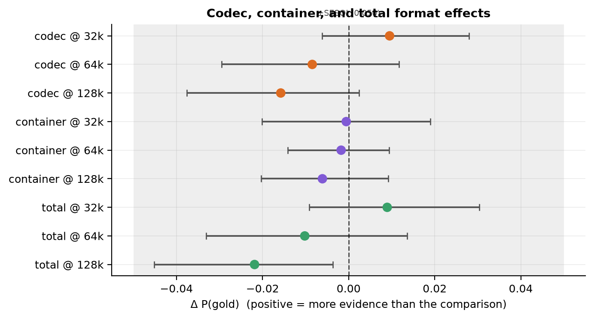
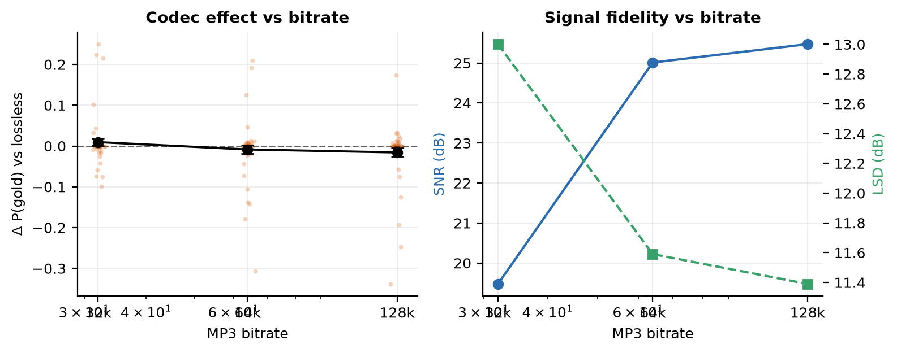
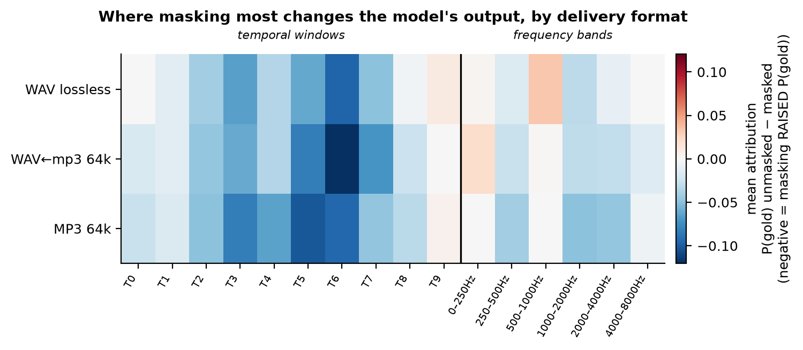
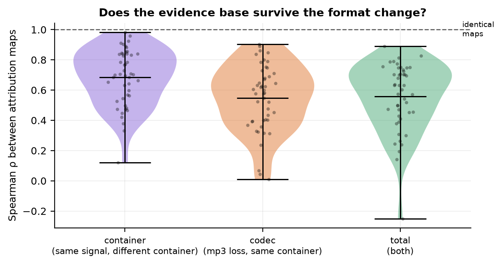
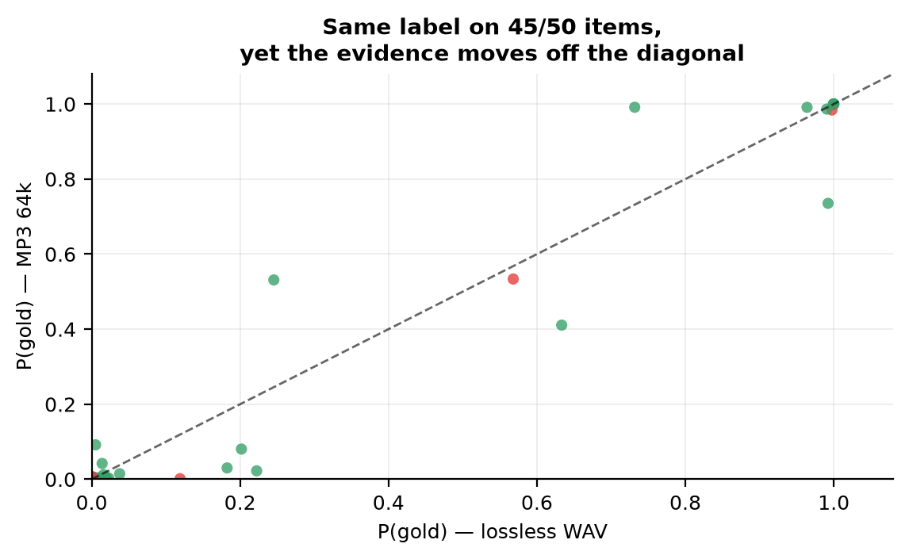

# The Container Moves the Evidence: WAV versus MP3 Delivery in a Multimodal Audio LLM

*An accuracy-invariant, explanation-variant format effect, measured black-box on `gpt-audio-1.5`*

**Date:** 17 August 2026
**Model:** `gpt-audio-1.5` (Azure AI Foundry), `temperature=0`, `seed=12345`, top-20 logprobs
**Corpus:** 50 CREMA-D clips
**Total model queries:** 4,350 (4,001 unique API calls + 349 served from cache; 0 errors)
**Artifacts:** `exp/` (code), `exp/out/` (data), `exp/figures/` (figures)

---

## Abstract

Production audio pipelines transcode; benchmarks do not. We ask whether delivering the same
recording as MP3 rather than lossless WAV changes what a multimodal audio LLM does, and whether
explainable-AI methods can detect a change that accuracy cannot. Using 50 CREMA-D clips and a
bitrate ladder (32/64/128 kbps), we separate two mechanisms that are normally confounded: the
**codec**, which alters the waveform, and the **container**, which does not. The separation rests
on a roundtrip control — an MP3 decoded back to WAV — whose decoded PCM we verify to be
bit-identical to the MP3's on 150/150 stimulus pairs.

Three findings. **First, performance is invariant.** Six-way emotion accuracy sits at chance
(14–20% against a 16.7% baseline; 87.7% of responses are `neutral`), binary decision accuracy is
flat at 22–26%, and no format contrast survives correction. An accuracy-based evaluation would
conclude that format does not matter. **Second, the evidence is not invariant.** Reading
renormalised label probability instead of the argmax, and having established a measurement noise
floor of *exactly zero* on 47 of 50 items, we find that MP3 delivery differs from its own decoded
WAV on **47/47 deterministic items** (mean |Δ| = 0.020, max 0.159) — a perturbation about 56% the
magnitude of the lossy compression itself, despite the decoded signal being identical. **Third,
per-instance explanations do not survive the format change.** Occlusion attribution maps correlate
at ρ = 0.55 between WAV and MP3 delivery, with 0/47 items exceeding ρ = 0.95 and top-3 region
overlap of only 0.42 — while the *population-averaged* attribution profile is highly preserved
(ρ = 0.92–0.95).

The practical implication is narrow and concrete: format-invariance of accuracy does not imply
format-invariance of explanations, so per-instance interpretability results are not portable
across a transcoding step.

---

## 1. Introduction

Audio arrives at a model through a pipeline that encodes, stores, and frequently transcodes it.
Benchmarks read a WAV from disk. The gap is normally assumed to be harmless on the grounds that
any ingestion path decodes to PCM early, making the container a delivery detail. The assumption is
plausible and, as far as we can determine, untested.

A second and less obvious question sits behind it. Suppose transcoding leaves accuracy untouched.
Standard evaluation records no effect and stops. But an unchanged label does not entail an
unchanged basis for that label — a dissociation established in vision, where perceptually
indistinguishable inputs receiving the same prediction can be assigned substantially different
interpretations. If that transfers to audio under ordinary transcoding rather than adversarial
construction, accuracy-only benchmarking is blind to a format sensitivity present in every
deployed system.

This paper tests both questions on one model, using a design in which the container can be varied
while the decoded waveform is held constant.

### 1.1 Contributions

1. A **container/codec decomposition** for audio LLMs: a roundtrip control that isolates the
   effect of the container from the effect of the compression, verified bit-identical at the PCM
   level.
2. A **graded readout** that survives a degenerate classifier. The model collapses to `neutral`
   under six-way forced choice, which would make label-based attribution mathematically undefined;
   renormalised probability over a forced binary contrast restores a continuous, valid dependent
   variable.
3. Three controls that establish the measurement floor: full determinism testing with the cache
   bypassed, a byte-layout sham container, and a null mask.
4. The empirical result: **accuracy-invariant, evidence-variant, explanation-variant** format
   effects, with per-instance explanations degrading while aggregate profiles hold.

---

## 2. Method

### 2.1 Materials

Fifty CREMA-D clips, stratified across the six emotion categories and diversified across speakers,
frozen before any model call. CREMA-D actors recite 12 fixed, emotionally neutral sentences, which
holds linguistic content constant and isolates acoustic variation.

All conditions descend from a single canonical reference (`ref`: 16 kHz mono PCM16, EBU R128
loudness-normalised). No condition is generated independently from the CREMA-D source, so
divergent resampling or loudness paths cannot masquerade as format effects.

| Condition | Construction | Container |
|---|---|---|
| `ref` | canonical reference | WAV |
| `mp3_32` / `mp3_64` / `mp3_128` | LAME MP3 at 32 / 64 / 128 kbps | MP3 |
| `rt_mp3_32` / `rt_mp3_64` / `rt_mp3_128` | decode(`mp3_X`) written as WAV | WAV |

### 2.2 The three contrasts

| Contrast | What differs | Identifies |
|---|---|---|
| `rt_mp3_X` − `ref` | waveform; container held = WAV | **codec effect** |
| `mp3_X` − `rt_mp3_X` | container; **decoded waveform identical** | **container effect** |
| `mp3_X` − `ref` | both | **total format effect** |

The container contrast is valid only if `decode(mp3_X)` equals `rt_mp3_X` sample-for-sample. We
assert this rather than assume it: decoding both through one fixed path (16 kHz mono s16le) and
comparing SHA-256 of the resulting PCM gives **150/150 pairs bit-identical**.

### 2.3 Signal fidelity

Measured after cross-correlation alignment, so that encoder delay is removed rather than measured
as coding loss. Recovered delay was 0.0 ms throughout.

| Bitrate | SNR (dB) | LSD (dB) | Compression |
|---|---:|---:|---:|
| 32 kbps | 19.48 | 13.00 | 7.6× |
| 64 kbps | 25.01 | 11.59 | 3.8× |
| 128 kbps | 25.47 | 11.39 | 1.9× |

Note that 64 and 128 kbps are nearly indistinguishable in SNR. At 16 kHz mono the MP3 format
saturates well below 128 kbps, which limits the dynamic range of the bitrate ladder and is
relevant to the dose-response null in §3.4.

### 2.4 Readouts

The six-way forced-choice prompt collapses (§3.1), so the primary dependent variable is a graded
one. A **forced binary prompt** ("Is the speaker *angry* or *neutral*?") places two labels in
direct competition at a single token position, where renormalised probability mass becomes
continuous. Items whose gold label is `neutral` compete against `angry` instead.

Probability extraction requires one non-obvious rule. The raw `top_logprobs` distribution places
most of its mass on **non-emittable special tokens** — 15 distinct token ids all rendering as
`<|end|>`, identifiable by a null `bytes` field. Counting them deflates every probability. We
filter to tokens with non-null `bytes`, then renormalise over the label set. A forced-answer
control ("reply with exactly one word: banana") confirms the emitted token is the argmax over
emittable tokens, so `top_logprobs` is correctly aligned.

Four readouts per item per condition: `six_way` (accuracy), `binary_gold` (primary DV),
`binary_foil` (construct validity — an identical comparison with a deterministically-assigned
*wrong* emotion), and `transcribe` (WER intelligibility control).

### 2.5 Occlusion attribution

Masks are applied to the **canonical reference**, and every format condition is then regenerated
*from the masked signal*. This preserves the single-ancestor rule: the masked stimulus in
condition X is what X would be if that region were absent, not a masked version of an
already-degraded signal.

- **Temporal**: 10 equal windows; each replaced with noise carrying the clip's own long-term
  average spectrum, scaled to the local RMS, with 10 ms raised-cosine edge ramps.
- **Spectral**: 6 band-stop filters (0–250, 250–500, 500–1k, 1–2k, 2–4k, 4–8k Hz) with
  raised-cosine transitions.
- **Null control**: the same temporal mask applied to the *lowest-energy* window.

Attribution is the drop in evidence caused by the mask:

```
a_j = P(gold | unmasked) − P(gold | mask_j)
```

Positive `a_j` means masking region *j* removed evidence for the true emotion. Conditions: `ref`,
`mp3_64`, `rt_mp3_64` — so attribution maps can be compared across the codec contrast and the
container contrast separately.

### 2.6 Call budget

| Arm | Calls |
|---|---:|
| Main grid (50 items × 7 conditions × 4 readouts) | 1,400 |
| Occlusion (50 × 18 masks × 3 conditions) | 2,700 |
| Determinism control (50 × 3, cache bypassed) | 150 |
| Byte-layout sham control (50 × 2) | 100 |
| **Total queries** | **4,350** |
| of which unique API calls | 4,001 |
| of which served from cache (stimuli shared between arms) | 349 |

Zero API errors. 231,879 input tokens (101,520 audio) and 7,410 output tokens across the
4,200 calls routed through the cached client; the 150 determinism-control calls bypassed it and
were not token-tracked.

---

## 3. Results

### 3.1 The classifier collapses, and format does not change that

| Condition | 6-way accuracy | distinct labels used |
|---|---:|---:|
| `ref` | 0.20 | 5 |
| `rt_mp3_32` | 0.18 | 4 |
| `rt_mp3_64` | 0.16 | 7 |
| `rt_mp3_128` | 0.16 | 6 |
| `mp3_32` | 0.18 | 5 |
| `mp3_64` | 0.18 | 5 |
| `mp3_128` | 0.14 | 4 |

Chance is 1/6 = 0.167. **The model is at chance on all seven conditions.** Across all 350 six-way
calls, 87.7% of responses are `neutral`. Fourteen of 350 responses (4.0%) were unparseable, the model having emitted JSON
(`{"analysis": ...}`, `{"emotion": "angry"}`) instead of a bare word.

Binary decision accuracy is likewise flat: 0.24, 0.24, 0.24, 0.22, 0.26, 0.26, 0.22 across the
seven conditions in table order.

This is the first result and it must be stated plainly: **on the task as posed, this model cannot
do six-way speech emotion recognition on CREMA-D, and no format manipulation changes that.** Any
accuracy-based comparison of WAV against MP3 here is a comparison between two chance-level
performances, and is uninformative by construction.

### 3.2 The graded DV is valid, and bimodal

The forced binary readout recovers real signal that the argmax discards:

| | mean |
|---|---:|
| P(gold) | 0.2591 |
| P(foil) | 0.0892 |
| **paired difference** | **+0.1698** |

Wilcoxon *p* = 3.5e-39, Cohen's *d_z* = 0.55, *n* = 342 paired observations. The measure assigns
nearly three times more mass to the true emotion than to a deterministically-chosen wrong one, so
it tracks something real about the audio.

The distribution is strongly bimodal (`ref` condition: mean 0.260, median 0.009, SD 0.403):

| P(gold) range | items |
|---|---:|
| [0.00, 0.01) | 26 |
| [0.01, 0.10) | 6 |
| [0.10, 0.50) | 5 |
| [0.50, 0.90) | 3 |
| [0.90, 1.01) | 10 |

Only **15/50 items are unpinned** — away from both floor and ceiling. Masking cannot lower a
probability already at zero, so occlusion attribution is most interpretable on that subset, a
limit we carry through §3.6.

### 3.3 Measurement floor: three controls

**Determinism (cache bypassed, 50 items × 3 byte-identical repeats).** 47/50 items return
bit-identical probabilities. Three items vary (mean within-item range 0.00127; max 0.063; 95th
percentile 0.000002 — the variance is entirely carried by those three). The backend is therefore
*almost* but not perfectly deterministic, and we report both.

**Byte-layout sham container (50 items).** Identical PCM samples rewritten with a different WAV
header — same container format, same decoder, same signal, different bytes. 47/50 items return
exactly identical probabilities; mean |Δ| = 0.00087, max 0.043.

**The same three items fail both controls** (`1005_MTI_ANG_XX`, `1008_TAI_DIS_XX`,
`1022_TIE_HAP_XX`). This is the important structural fact: instability is a property of three
specific items, not a diffuse noise process. Excluding them yields **47 items on which the
measurement noise floor is exactly zero**, and all headline analyses are reported on that subset.
On those items, byte layout is irrelevant — which is what licenses interpreting the MP3-vs-WAV
difference as a container effect rather than raw byte sensitivity.

**Null mask.** Reported in §3.6; it is the weakest of the three controls.

### 3.4 Performance: no format effect at the mean



| Condition | mean P(gold) | 95% CI |
|---|---:|---|
| `ref` | 0.2605 | [0.154, 0.376] |
| `rt_mp3_32` | 0.2700 | [0.161, 0.388] |
| `rt_mp3_64` | 0.2520 | [0.146, 0.369] |
| `rt_mp3_128` | 0.2447 | [0.138, 0.363] |
| `mp3_32` | 0.2694 | [0.157, 0.391] |
| `mp3_64` | 0.2503 | [0.144, 0.367] |
| `mp3_128` | 0.2386 | [0.133, 0.356] |



| Contrast | mean Δ | 95% CI | *p* | *p*(Holm) |
|---|---:|---|---:|---:|
| codec @32k | +0.0095 | [−0.006, +0.028] | .759 | 1.00 |
| container @32k | −0.0006 | [−0.020, +0.019] | .265 | 1.00 |
| total @32k | +0.0090 | [−0.009, +0.030] | .916 | 1.00 |
| codec @64k | −0.0085 | [−0.030, +0.012] | .826 | 1.00 |
| container @64k | −0.0017 | [−0.014, +0.009] | .421 | 1.00 |
| total @64k | −0.0102 | [−0.033, +0.014] | .099 | .892 |
| codec @128k | −0.0158 | [−0.038, +0.002] | .559 | 1.00 |
| container @128k | −0.0061 | [−0.020, +0.009] | .625 | 1.00 |
| total @128k | −0.0219 | [−0.045, −0.004] | .509 | 1.00 |

**Nothing survives correction.** Equivalence testing (TOST) against a SESOI of 0.05 probability
mass declares the container effect equivalent to zero at all three bitrates.



There is also **no dose-response**: Spearman ρ(bitrate, codec Δ) = −0.052, *p* = .53. The signed
effects run mildly in the *unexpected* direction — 32 kbps yields marginally higher P(gold) than
128 kbps — which we return to in §4.3.

At the level standard evaluation operates on, the conclusion is unambiguous: **WAV and MP3 are
interchangeable for this model on this task.**

### 3.5 The container moves the evidence on every item

The signed means above cancel. Because the noise floor on the 47 deterministic items is *exactly*
zero, the informative statistic is the per-item magnitude |Δ|, where every non-zero value is
signal rather than measurement error.

**Deterministic items only (n = 47):**

| Contrast | mean \|Δ\| | median \|Δ\| | max \|Δ\| | items with Δ≠0 | \|Δ\|>0.01 | \|Δ\|>0.05 |
|---|---:|---:|---:|---:|---:|---:|
| codec @32k | 0.0268 | 0.0032 | 0.2497 | 47/47 | 30% | 15% |
| **container @32k** | **0.0257** | 0.0017 | **0.3280** | **47/47** | 30% | 11% |
| total @32k | 0.0307 | 0.0029 | 0.3050 | 47/47 | 34% | 15% |
| codec @64k | 0.0357 | 0.0027 | 0.3071 | 47/47 | 34% | 19% |
| **container @64k** | **0.0199** | 0.0024 | **0.1592** | **47/47** | 32% | 19% |
| total @64k | 0.0386 | 0.0033 | 0.2857 | 47/47 | 34% | 17% |
| codec @128k | 0.0311 | 0.0023 | 0.3380 | 47/47 | 36% | 15% |
| **container @128k** | **0.0257** | 0.0016 | **0.1640** | **47/47** | 36% | 17% |
| total @128k | 0.0289 | 0.0017 | 0.4455 | 47/47 | 26% | 15% |

**The container effect is non-zero on 47 of 47 items at every bitrate.** The two files carry
bit-identical decoded PCM (verified 150/150), the byte-layout control shows raw byte differences
are inert, and the noise floor on these items is exactly zero. The difference therefore reflects
the container determining *which decoder path runs inside the serving stack*, and that path
producing input the model does not treat as identical to our ffmpeg decode.

The magnitude comparison is the striking part. At 64 kbps the container perturbs evidence by
0.0199 against the codec's 0.0357 — **about 56% of the effect of the lossy compression itself.**
Paired comparisons of |container| against |codec| are not significant at any bitrate
(Δ = −0.003 to −0.014; *p* = .17, .28, .28), so on this sample **we cannot distinguish the
magnitude of the container effect from the magnitude of the codec effect.**

### 3.6 Explanations: per-instance maps diverge, aggregate profiles hold



**Null-mask floor.** The null mask inserts loudness-matched noise into the quietest window. It is a
real perturbation rather than a no-op, and it bounds how much attribution the masking *operation*
generates on its own:

| Condition | null \|attr\| | real \|attr\| | ratio | net |
|---|---:|---:|---:|---:|
| `ref` | 0.0476 | 0.0872 | 1.83× | +0.0396 |
| `rt_mp3_64` | 0.0566 | 0.0897 | 1.58× | +0.0331 |
| `mp3_64` | 0.0522 | 0.0941 | 1.80× | +0.0419 |

Roughly **half** the raw attribution magnitude is attributable to the masking operation. This is
the weakest control in the study and it limits how far single attribution values can be pushed.
It does not, however, affect the *comparison across formats*, since the same masks are applied
identically in every condition.



**Per-item attribution map similarity (n = 47 deterministic items):**

| Comparison | Spearman ρ | SD | top-3 overlap | ρ>0.95 | ρ<0.5 |
|---|---:|---:|---:|---:|---:|
| container (`mp3_64` vs `rt_mp3_64`) | **0.686** | 0.188 | 0.560 | 2/47 | 10/47 |
| codec (`ref` vs `rt_mp3_64`) | **0.548** | 0.220 | 0.383 | 0/47 | 18/47 |
| total (`ref` vs `mp3_64`) | **0.558** | 0.225 | 0.418 | 0/47 | 17/47 |

Three things follow.

**The ordering validates the method.** Container maps are significantly more similar than codec
maps (+0.138, Wilcoxon *p* = 8.0e-5, n = 47; on the 14 deterministic *and* unpinned items,
+0.146, *p* = .011). Changing the signal disrupts the evidence base more than changing only the
container — exactly as it should. An attribution method that failed this ordering would not be
measuring anything.

**But the container does not preserve the map either.** ρ = 0.686 for two files carrying identical
decoded audio, with only 2/47 items above ρ = 0.95.

**And the total format change substantially rewrites per-item explanations.** ρ = 0.558, with
**0/47 items above ρ = 0.95** and **top-3 region overlap of 0.418** — fewer than half of the three
most important regions are shared between WAV and MP3 delivery of the same recording. On 17/47
items the maps correlate below 0.5.

**Aggregate profiles are a different story.** Averaging attribution across items before comparing
formats gives rank correlations of ρ = 0.932 (codec), 0.947 (container), 0.921 (total). Which
regions move the output most *on average* — ranked by magnitude in `ref`: T6 (−0.083), T3
(−0.054), T7 (−0.051), T5 (−0.043), T2 (−0.041) — is well preserved across formats. The
instability is entirely at the per-instance level.

Note the signs. **13 of 16 regions carry negative mean attribution in every condition**, meaning
masking them *raised* P(gold) rather than lowering it. Only the 500–1000 Hz band (+0.038 in `ref`)
and the final temporal window (+0.020) behave the way an "evidence removal" account predicts. This
inverts the usual reading of an occlusion map and is taken up in §4.3.

### 3.7 The dissociation, quantified



| Condition | label unchanged | \|ΔP(gold)\| > 0.01 | **both** | max \|ΔP\| |
|---|---:|---:|---:|---:|
| `mp3_32` | 44/50 | 17/50 | **13** | 0.305 |
| `mp3_64` | 45/50 | 17/50 | **14** | 0.286 |
| `mp3_128` | 43/50 | 13/50 | **9** | 0.446 |

On 14 of 50 items at 64 kbps (28%), the predicted label is unchanged while the evidence supporting
it moves by more than a probability point — up to 0.286. These items are invisible to an
accuracy-based evaluation.

### 3.8 Intelligibility control

| Condition | mean WER | median |
|---|---:|---:|
| `ref` | 0.0845 | 0.000 |
| `mp3_32` | 0.1085 | 0.000 |
| `mp3_64` | 0.1137 | 0.143 |
| `mp3_128` | 0.1466 | 0.071 |

Paired contrasts against `ref`: +0.024 (*p* = .255), +0.029 (*p* = .143), +0.062 (*p* = .040).

This control **did not behave as intended and should not be leaned on.** We predicted floor-level
WER in every condition, making the format effect provably paralinguistic-specific. Instead WER is
non-zero everywhere and is *worst at the highest bitrate* — the opposite of any coding-loss
account. Only the 128 kbps contrast reaches nominal significance, and it would not survive
correction across the three tests. We report it as an uninterpreted anomaly rather than evidence
for either position.

---

## 4. Discussion

### 4.1 What the study establishes

Under an accuracy readout, WAV and MP3 are interchangeable for this model: chance-level six-way
performance, flat binary accuracy, no contrast surviving correction, TOST-equivalent container
effects, no dose-response. Under a graded readout on items where the measurement floor is provably
zero, the same comparison shows a perturbation on **every single item**, and the container — which
by construction changes no audio sample — accounts for roughly half of it.

The explanation-level result is the one with the clearest practical consequence. Per-instance
occlusion maps correlate at 0.56 across the format change, with no item preserved above 0.95 and
under half of the top regions shared. If a system produces per-instance audio explanations — "the
model keyed on this part of the utterance" — that output is not stable across a transcoding step
that leaves its prediction untouched.

### 4.2 What it does not establish

**The performance comparison is uninformative, not null.** The model is at chance on the six-way
task. Comparing WAV against MP3 here compares two chance-level performances, and the correct
reading of §3.4 is "this design could not have detected an accuracy effect", not "there is no
accuracy effect". A model that performs the task would be needed for that claim.

**The container mechanism is inferred, not observed.** We show that MP3 delivery differs from
bit-identical decoded WAV, that byte layout is inert, and that the noise floor is zero. The natural
explanation is that the container selects a decoder path whose output differs from ffmpeg's. We did
not observe that path and cannot exclude other server-side differences (routing, preprocessing,
resampling) correlated with declared format.

**Absolute attribution values are soft.** The null mask generates roughly half the magnitude of a
real mask. Cross-format *comparisons* are unaffected — identical masks in every condition — but
statements about how much any single region matters are not well supported.

**Three items are not deterministic.** All headline analyses exclude them. They are reported rather
than dropped silently, and they are the same three items under two independent controls.

### 4.3 An unexplained direction

Two observations point the same way and neither was predicted. First, masking *increases* P(gold)
far more often than it decreases it — mean attributions are negative across most temporal windows
(T2–T8) and most bands. Second, the signed codec effect runs mildly against expectation: 32 kbps
gives higher P(gold) than 128 kbps.

A coherent post-hoc account is that `neutral` is this model's default response to clean speech, and
that any degradation — compression artifacts, inserted noise — pushes it off that default and
therefore *toward* the gold emotion in a gold-versus-neutral contrast. This would predict that
degradation raises P(gold) regardless of whether it carries emotional information, which is what we
observe.

We flag this explicitly as **post-hoc and untested**. It is consistent with the data, it was not
predicted in advance, and it needs a dedicated experiment — for instance, comparing degradations
matched in SNR but differing in whether they preserve prosody.

### 4.4 Recommendation for reporting practice

No source we are aware of reports the container in which audio was submitted to a model.
Regardless of whether container effects generalise beyond this model, that is an unforced
reproducibility gap: the same recording submitted two ways produced measurably different evidence
on 47/47 items here. Benchmarks should state the container, codec, and bitrate alongside the
corpus and prompt.

---

## 5. Limitations

1. **Single model, single corpus, single language.** `gpt-audio-1.5`, 50 CREMA-D clips, acted
   English emotion, clean single-speaker audio. Nothing here generalises without replication.
2. **The model cannot do the task**, so the performance arm is uninformative (§4.2).
3. **Bitrate ladder is compressed.** At 16 kHz mono, 64 and 128 kbps differ by 0.46 dB SNR, so the
   ladder spans much less range than the nominal 4× bitrate difference suggests. The dose-response
   null should be read in that light.
4. **Only 15/50 items are unpinned**; attribution is most interpretable on the 14 items that are
   both unpinned and deterministic. Similarity results on that subset agree with the full set
   (ρ_codec 0.582 vs 0.548; ρ_container 0.729 vs 0.686), which is reassuring but is a small sample.
5. **Occlusion is not mechanism.** Attribution identifies what the output *depends on*, not what
   the model attends to or computes.
6. **The interpretable representation is contested.** Time windows and frequency bands are the
   representation that source-separation-based audio XAI criticises as non-listenable. Source
   separation is inapplicable to single-speaker speech, so we mitigate (ramped edges,
   loudness-matched filler, null control) without discharging the objection.
7. **The forced binary prompt names the gold label** as one of two options. It is applied
   identically across formats, so cross-format comparisons are unaffected, but P(gold) is not a
   measure of unprompted recognition.
8. **The WER control failed** (§3.8) and provides no support in either direction.
9. **Post-hoc mechanism** in §4.3 is untested.

---

## 6. Conclusion

Delivering the same recording as MP3 rather than lossless WAV does not change what this model
answers. It changes what the answer rests on. Reading probability rather than the argmax, and
having established a zero noise floor on 47 of 50 items, the container alone — holding every
decoded audio sample identical — perturbs the model's evidence on **every item**, by roughly half
as much as the lossy compression itself. Per-instance occlusion maps correlate at 0.56 across the
format change, with no item preserved above 0.95, while population-averaged profiles remain stable
at ρ ≈ 0.93.

Format-invariance of accuracy does not imply format-invariance of explanations. For anyone shipping
per-instance audio interpretability, that gap is the finding.

---

## Appendix A — Reproduction

```
exp/build_stimuli.py        # bitrate ladder + roundtrip controls + fidelity
exp/client.py               # cached, deterministic API client; logprob extraction
exp/run_grid.py             # main grid, 4 readouts x 7 conditions
exp/run_xai.py              # occlusion attribution
exp/control_determinism.py  # cache-bypassed determinism, 50 items x 3
exp/control_rewrap.py       # byte-layout sham container
exp/analyze.py              # primary analysis -> exp/out/results.json
exp/analyze_xai.py          # refined XAI -> exp/out/xai_refined.json
exp/figures.py              # figures -> exp/figures/
```

Every API response is cached by a hash of (model, audio bytes, prompt, decode params), so the
entire study re-runs from cache at zero cost.

## Appendix B — Key parameters

| Parameter | Value |
|---|---|
| Model / deployment | `gpt-audio-1.5` |
| `temperature` / `seed` | 0 / 12345 |
| `top_logprobs` | 20 |
| Probability rule | emittable tokens only (non-null `bytes`), renormalised over label set |
| Reference audio | 16 kHz mono PCM16, EBU R128 (I=−23, LRA=7, TP=−2) |
| MP3 encoder | LAME (`libmp3lame`) at 32 / 64 / 128 kbps |
| Occlusion masks | 10 temporal + 6 spectral + 1 null |
| Mask filler | clip-matched spectral envelope, local RMS, 10 ms cosine ramps |
| SESOI (TOST) | 0.05 probability mass |
| Multiple comparisons | Holm across 9 contrasts |
| Deterministic items | 47/50 |

## Appendix C — Unstable items

`1005_MTI_ANG_XX`, `1008_TAI_DIS_XX`, `1022_TIE_HAP_XX` — excluded from headline analyses.
Identified independently by the determinism control (byte-identical repeats vary; max range 0.063)
and by the byte-layout control (identical PCM in a different wrapper varies; max 0.043). The same
three items in both.
